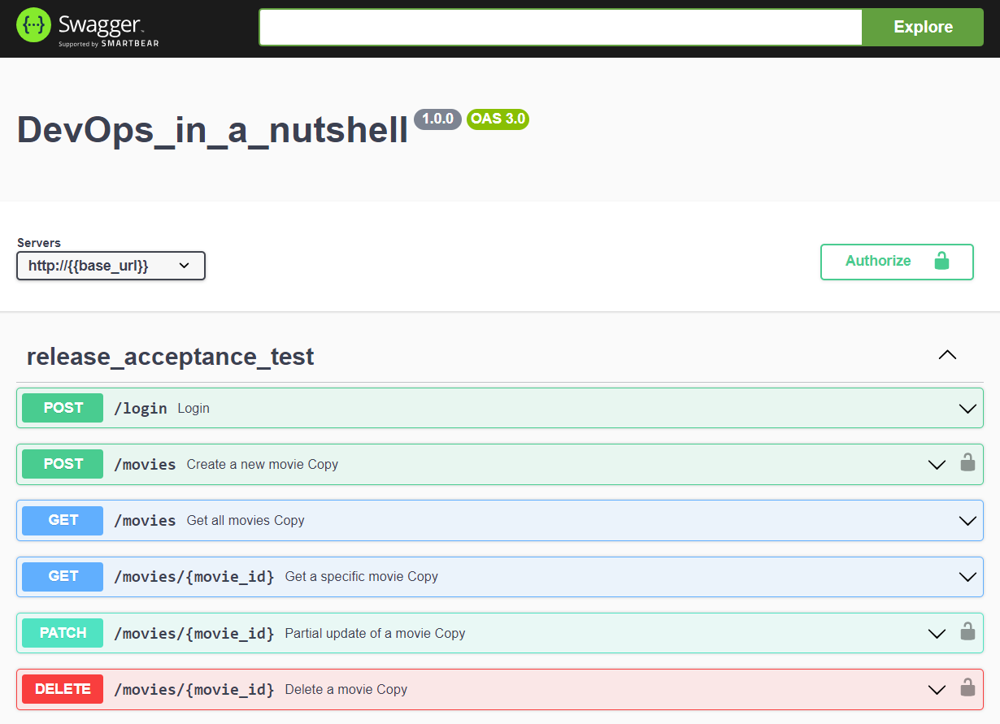

# DevOps in the Nutshell

Welcome to the **DevOps in the Nutshell** project! This demo project showcases an end-to-end DevOps procedure using a combination of technologies to highlight the various stages involved in modern software development, from coding to deployment and operations.

## Overview
In this project, we've put together a backend web application built with Flask that connects to a MongoDB database. We utilize Nginx as the web server for serving the application. The project demonstrates the entire DevOps cycle, including development, testing, deployment, and monitoring.

## Technology Stack

| Aspect                         | Description                                                                                                              |
| ------------------------------ | ------------------------------------------------------------------------------------------------------------------------ |
| Web Application                | Built using Flask as the foundation, leveraging its lightweight web framework capabilities.                            |
| Data Storage                   | Managed by MongoDB, a versatile NoSQL database, ensuring efficient and flexible data management.                      |
| Continuous Integration (CI)    | Facilitated by GitHub Actions, automating the initiation of end-to-end tests upon pull request submission to main.      |
| Testing                        | Utilizes Postman scripts to implement automated end-to-end tests, generating comprehensive reports upon completion.    |
| Deployment                     | Entire environment, once validated, can be deployed onto a server, offering consistent and controlled deployment.      |
| Web Server                     | Nginx serves as the web server, enhancing application delivery through its reverse proxy and static content capabilities. |
| Monitoring & Log Collection    | Application's Nginx logs are collected, analyzed, and sent to Elasticsearch, providing valuable insights for monitoring. |
| Dashboard                      | Kibana is employed to craft an informative real-time dashboard, offering insights into application performance and status.|

## Screenshots
### API Call
"The supported APIs of the Flask web application are displayed using Swagger UI.

### Test Result of Postman
A screenshot showing the test results from Postman scripts used for automated testing.

### Dashboard in Kibana

Description: A dashboard in Kibana visualizing log and performance data from the deployed application.
